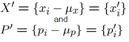
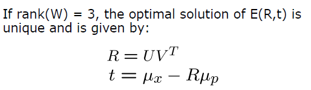
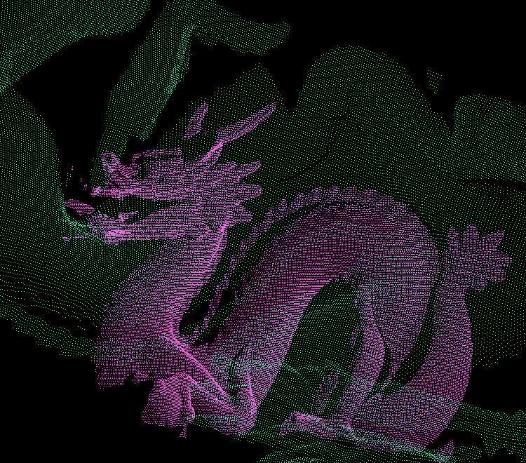

Iterative Closest Point Scan-Matching
================

**University of Pennsylvania, CIS 565: GPU Programming and Architecture, Project 4**

Peyman Norouzi
* [LinkedIn](https://www.linkedin.com/in/peymannorouzi)
* Tested on: Windows 10, i7-6700 @ 3.40GHz 16GB, Quadro P1000 4096MB (Moore 100B Lab)

## Iterative Closest Point (ICP):

  

In Computer Vision, the Iterative closest point (ICP) is an algorithm employed to minimize the difference between two clouds of points. ICP can help to reconstruct 2D or 3D images/surfaces from various scans that may not at first perfectly lineup. ICP can also be used to localize robots/autonomous cars and thus plan their's paths optimally. That is one of the main reason's that I decided to implement the algorithm on CUDA.

## Table of Contents:

- [ICP's mathematical algorithm](#icp-s-mathematical-algorithm)
- [Implementations](#implementations)
  * [CPU Implementation](#cpu-implementation)
  * [GPU Implementation](#gpu-implementation)
- [Perfomance Implementation and Analysis](#perfomance-implementation-and-analysis)
- [Bloopers](#bloopers)
- [Sources](#sources)

## ICP's mathematical algorithm:

The basic idea of ICP is that if the correspondence between two-point cloud is known(by taking the closest point to points in cloud 1 from cloud 2), the correct relative rotation/translation that can iteratively coverage the two clouds can be calculated in closed form. The Basic algorithm can be seen in the plot below (taken from [Here](https://www.researchgate.net/figure/a-Illustration-of-registration-process-using-ICP-algorithm-b-Schematic-representation_fig1_275540074))

  

## Implementations:

I have implemented the ICP algorithm both on the CPU and the GPU. Since the algorithm has many matrix operations, most of its calculation can be easily parallelized thus I expect the GPU implementation can outperform the CPU implementation significantly.

### CPU Implementation

In the CPU implementation we have the following steps:

1. For each point in the source, find the corresponding closest point in the target (time complexity: **O(N^2)**)
2. Find the mean and move both corresponding and initial points accordingly as follows (time complexity: **O(N)**)

  

3. Use SVD to find U and V as follows:

  

4. Using the current information use the following theorem to find approaprite rotation and translation matrices

  

5. Update the initial points according to the rotation and translation matrices (time complexity **O(N)**)
6. Repeat the steps above untill convergence (time complexity: **O(num_iters)**)

As you can see the process overall is going to have roughly O(N^2) time complexity which is pretty bad considering that the objects we are working with here have more than 40000 points!

### GPU Implementation

The GPU implementation is going to follow the same logic as the CPU implementation but it will parallelize most of the steps as follows:

1. For each point in the source(in parallel), find the corresponding closest point in the target (time complexity: **O(N)**)
2. Find the mean and move both corresponding and initial points accordingly as follows (time complexity: **O(logN)**)

  

3. Use SVD to find U and V as follows:

  

4. Using the current information use the following theorem to find approaprite rotation and translation matrices

  

5. Update the initial points according to the rotation and translation matrices (time complexity **O(1)**)
6. Repeat the steps above untill convergence (time complexity: **O(num_iters)**)

As you can see the process overall is going to have roughly O(N) time complexity which means we should be expecting a great amount of improvement as N (number of points) increases.

Let's look at their difference, shall we??

| CPU | GPU |
| ------------- | ----------- |
|   |  |

## Perfomance Implementation and Analysis:

The comparison above kind of opens the door easily to get to the nitty gritty comparison between the CPU implementation and the GPU one. The table below shows the comparison between the two in the amount of time it takes for each to complete one iteration. (Steps 1 to 5)

  

As you can see the difference between CPU and GPU is quite drastic! it is around 100 folds! This test was done on around 42000 points(the number of points for the dragon object). As the number of points increases, I expect the performance difference between CPU and GPU to become even more prominent! Now that we know GPU is way better than the CPU implementation, Let's see what blocksize for the GPU would give us the best performance! The chart below shows the performance difference between various block sizes on the GPU. 

  

## Bloopers:

Here are some bloopers showing that everyone can and will make mistakes along the way. Please make sure you are doing your math right lol :)

  

## Sources:

[ICP_Lecture](http://ais.informatik.uni-freiburg.de/teaching/ss11/robotics/slides/17-icp.pdf)

[Iterative closest point Wiki](https://en.wikipedia.org/wiki/Iterative_closest_point)

[Development of an Inspection System for Defect Detection in Pressed Parts Using Laser Scanned Data](https://www.researchgate.net/figure/a-Illustration-of-registration-process-using-ICP-algorithm-b-Schematic-representation_fig1_275540074)

